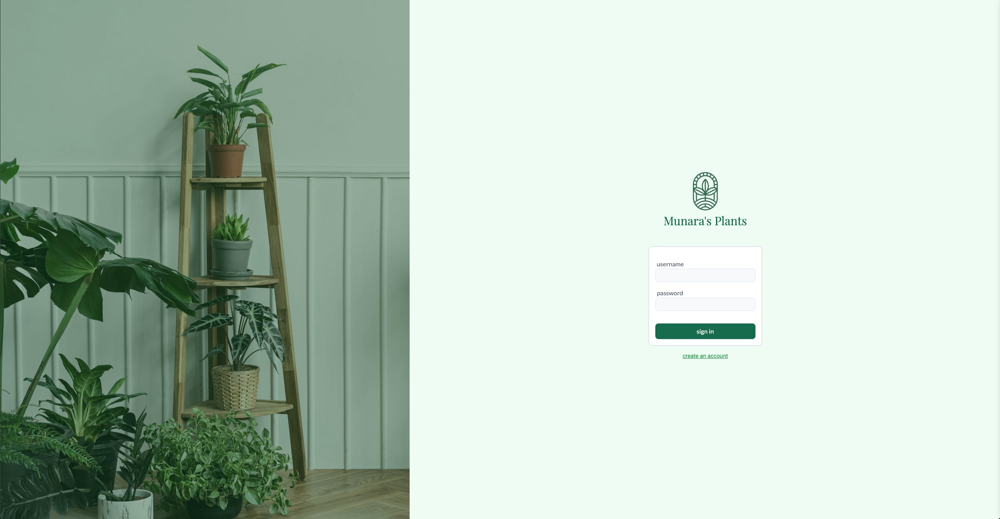
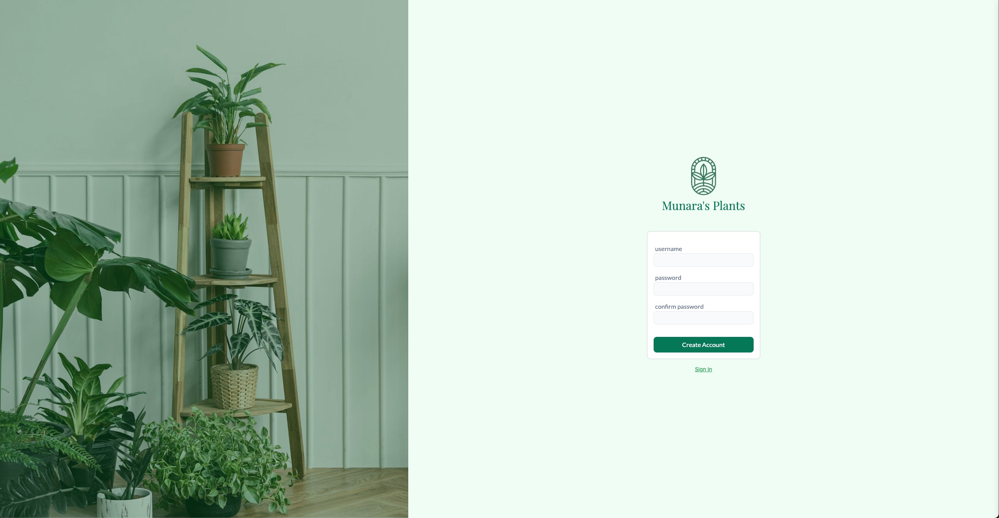
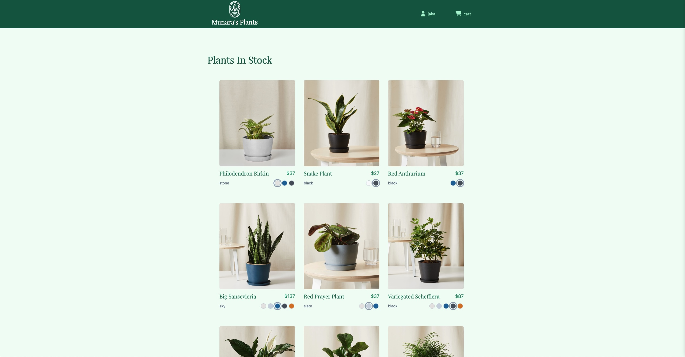
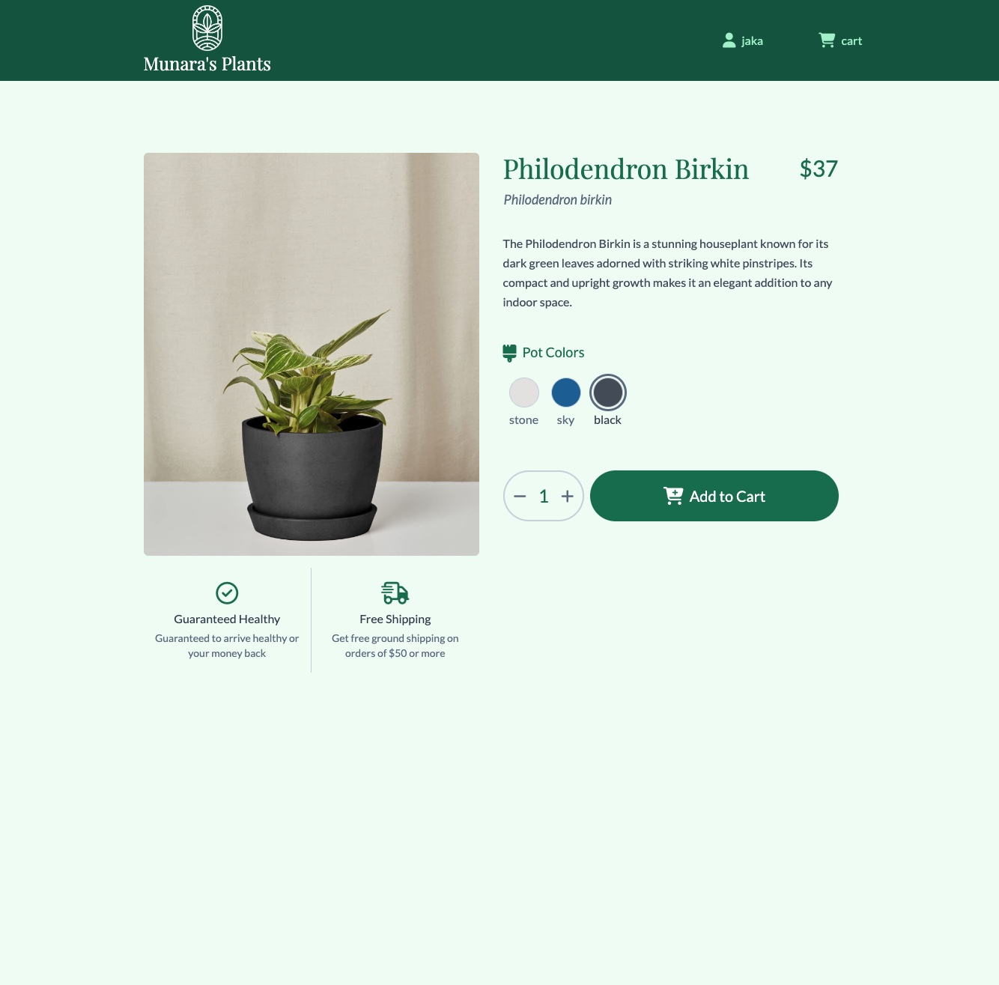
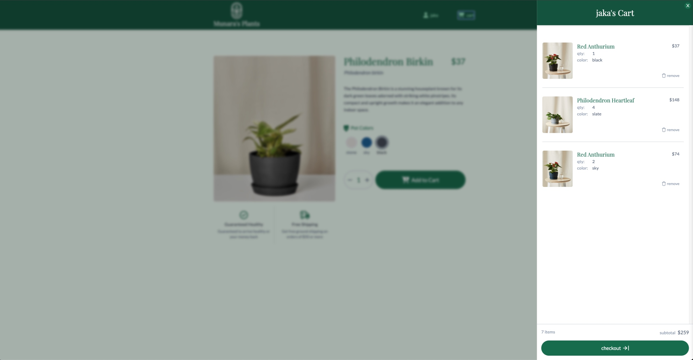

# Munara's Plants

Welcome to the Munara's Plants project! This web application is an e-commerce project, offering a curated selection of plants for customers. Users can browse the collection, add their favorite plants to the cart, and seamlessly complete purchases, providing a convenient and enjoyable shopping experience for plant lovers.

You can access the live project here: [Munara's Plants](https://munaras-plants.onrender.com)

## Table of Contents
- [Screenshots](#screenshots)
- [Features](#features)
- [Technologies Used](#technologies-used)
- [Getting Started](#getting-started)
  - [Installation](#installation)
  - [Usage](#usage)
- [License](#license)

<h2 id="screenshots">Screenshots</h2>

Here are some screnshots of the Munara's Plants Website:

### Sign In Page

### Sign Up Page

### Plants List Page

### Plant Info Page

### Cart Page

<h2 id="features">Features</h2>

- **User-Friendly Interface:** A clean and intuitive design that allows users to easily navigate and explore plant selections.
- **Plant Catalog:** A wide variety of plants available for browsing with detailed descriptions and images.
- **Add to Cart:** Users can select and add multiple plants to their shopping cart for easy checkout.
- **Cart Management:** Ability to view, update, or remove items from the cart before proceeding to checkout.
- **Responsive Design:** Optimized for all devices, providing a seamless shopping experience on desktops, tablets, and mobile devices.
- **Customer Account:** Users can create accounts to track their orders and save their favorite plants for future purchases.

<h2 id="technologies-used">Technologies Used</h2>

- HTML5
- Tailwind CSS
- JavaScript
- React.js
- Redux
- React Router
- Express
- Postgres
- Sequelize
- JWT (JSON Web Token)

<h2 id="getting-started">Getting Started</h2>

<h3 id="installation">Installation</h3>

To run the project locally, follow these steps:

1. Clone this repository: git clone https://github.com/jandos0492/munaras-plants.git
2. Navigate to the project directory: cd munaras-plants
3. Navigate to the backend directory: cd backend
4. Create a .env file:
    - Refer to the .env.example file to know the required environment variables.
    - Fill the .env file with appropriate values (e.g., database connection URL, JWT secret, etc.).
5. Install backend dependencies: npm install
6. Create the database: npm run db:create
7. Migrate the models to the database: npm run db:migrate
8. Seed the database with initial data: npm run db:seed:all
9. Start the backend development server: npm start
    - The backend server should now be accessible in your browser at http://localhost:3000
10. Navigate to the frontend directory: cd ../frontend
11. Install the frontend dependencies: npm install
12. Start the development server: npm start
    - The website should now be accessible in your browser at: http://localhost:3001

<h3 id="usage">Usage</h3>

The NYC Practice Permit Test platform offers a structured approach to help you prepare for your New York City driver's permit test. Follow these steps to make the most of the practice materials:

#### 1. User Authentication

- **Sign Up:** If you're a new user, click on the "Sign Up" link located on the navigation bar. Provide the required information to create your account. 

- **Sign In:** If you already have an account, click on the "Sign In" link on the navigation bar. Enter your credentials (username and password) to log in.

#### 2. Browsing Plants

- After signing up, you will be automatically redirected to http://localhost:3001/plants, where you can view a list of available plants.
- You can browse through various plant categories and explore different options by clicking on each plant for detailed information.

#### 3. Adding Plants to Cart

- Click on a plant to view its details and select the desired color and quantity.
- Add the selected plant to your cart by clicking the "Add to Cart" button.
- You can continue shopping and add more plants to your cart, or view your cart at any time by clicking on the cart icon in the navigation bar.

Enjoy shopping for plants on Munara's Plants and easily manage your cart and purchases!

<h2 id="license">License</h2>

This project is licensed under the MIT License.